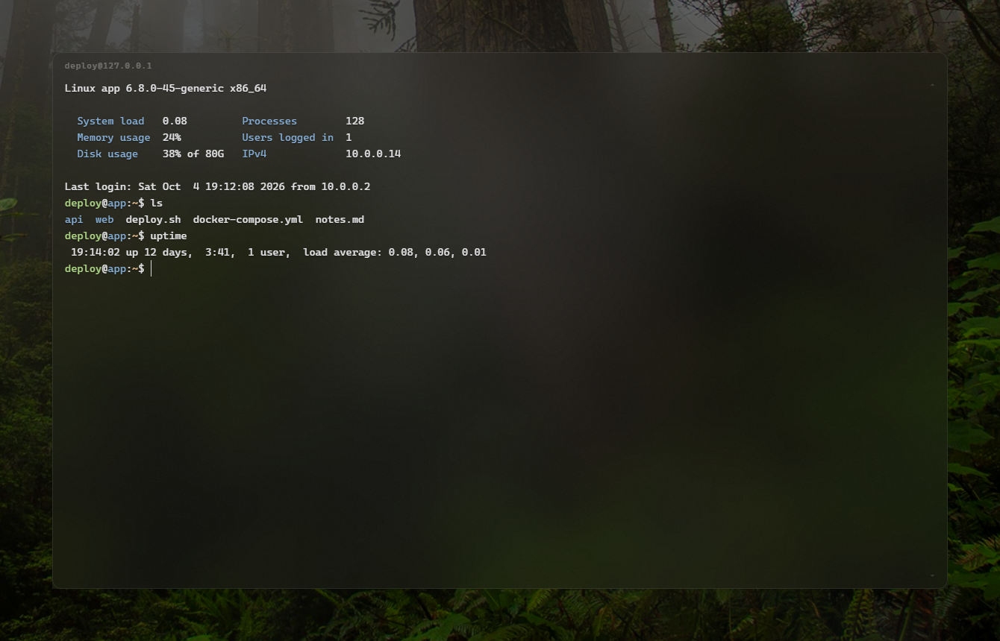
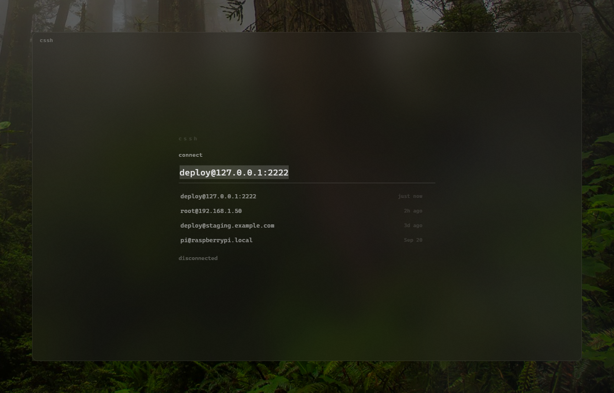
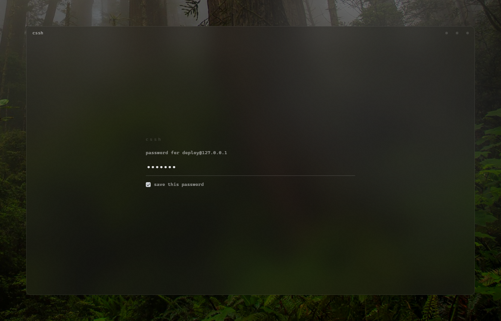
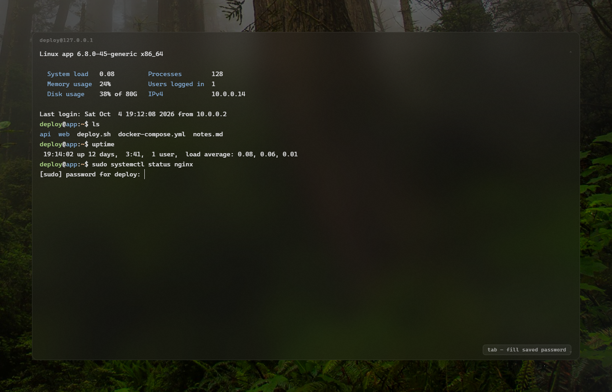

<h1 align="center">cssh</h1>

<p align="center">
  A minimal SSH client for Windows.<br>
  One window, one connection, no chrome — a frosted pane of glass with a prompt in the middle of it.
</p>

<p align="center">
  
</p>

---

## Why

Every SSH client I tried was either a terminal emulator with an SSH tab bolted
on, or a connection manager with a tree view, a toolbar and six panes. I wanted
the opposite: type `user@host`, press enter, be in a shell. Everything else
either hides until you need it or isn't there at all.

The glass is the other half of it. Not a dark window at 80% opacity — the real
Windows blur, so whatever is behind the terminal is legible as *texture* and
never competes with the text.

## Download

Grab `cssh.exe` from the [latest release](https://github.com/Zernic/cssh/releases/latest).
It's portable — no installer, no Node, nothing to set up. Put it anywhere and run it.

> **Windows will warn you the first time.** The download is unsigned (code-signing
> certificates cost a few hundred dollars a year), so SmartScreen shows a blue
> *"Windows protected your PC"* box. Click **More info → Run anyway**. If you'd
> rather not take my word for it, the source is right here — [build it yourself](#building-from-source).

Requires Windows 11 or Windows 10 (2004+) for the blur. On older builds the
window falls back to plain transparency.

## What it does

### Hosts remember themselves



Every host that gets you a shell is saved — most recent first, with when you last
used it. No "add connection" dialog. Arrow keys or a click to pick one, type to
filter, and what you type completes inline from your saved hosts and your
`~/.ssh/config` aliases.

### Passwords, if you want them



Tick the box and the password is kept — encrypted through the Windows keystore
(DPAPI), tied to your Windows account, never written in the clear. Next time,
you're logged in without being asked.

### One key for sudo



When the far end asks for a password — `sudo`, usually — cssh notices and offers
the one it has. Press <kbd>Tab</kbd> and it's typed and submitted. Start typing
yourself and the offer disappears, so it can never fill underneath you.

### And the rest

- **Host keys** are trusted on first use and pinned. If a known host's key ever
  changes, cssh refuses to connect and tells you what changed, rather than asking
  you to click through a warning.
- **Auth order** is the usual one: ssh agent → `~/.ssh/id_*` → saved password →
  prompt → keyboard-interactive, so hardware keys and 2FA both work.
- **`~/.ssh/config` aliases** are honoured (HostName, User, Port, IdentityFile).
- **Drag a maximized window** and it restores under your cursor, like every other
  Windows app.

## Keys

| | |
| --- | --- |
| <kbd>enter</kbd> | connect / answer the prompt |
| <kbd>esc</kbd> | back out · clear the box · close the window |
| <kbd>ctrl</kbd>+<kbd>a</kbd> | select the whole box (`^A` still works in the shell) |
| <kbd>ctrl</kbd>+<kbd>s</kbd> | toggle the save-password box |
| <kbd>tab</kbd> | fill a saved password at a remote prompt |
| <kbd>ctrl</kbd>+<kbd>shift</kbd>+<kbd>c</kbd> / <kbd>v</kbd> | copy / paste (<kbd>ctrl</kbd>+<kbd>v</kbd> also pastes) |
| right click | copy the selection, or paste if there isn't one |
| <kbd>ctrl</kbd>+<kbd>=</kbd> / <kbd>-</kbd> / <kbd>0</kbd> | text bigger / smaller / back to 14px |
| <kbd>ctrl</kbd>+<kbd>shift</kbd>+<kbd>↑</kbd> / <kbd>↓</kbd> | more / less tint over the glass |
| <kbd>ctrl</kbd>+<kbd>shift</kbd>+<kbd>g</kbd> | frosted ↔ clear |
| <kbd>ctrl</kbd>+<kbd>shift</kbd>+<kbd>d</kbd> | disconnect, back to the menu |
| <kbd>ctrl</kbd>+<kbd>shift</kbd>+<kbd>n</kbd> / <kbd>w</kbd> | new window / close window |
| <kbd>ctrl</kbd>+<kbd>shift</kbd>+<kbd>enter</kbd> | maximize |

Drag the top strip to move the window, double-click it to maximize. The window
controls fade in when the pointer is over the window.

You can also launch straight into a host:

```
cssh.exe user@host
```

## Config

Settings live in `%USERPROFILE%\.cssh\config.json`, written when you change the
font size or the tint. Everything is optional:

```jsonc
{
  "fontFamily": "\"Cascadia Mono\", Consolas, monospace",
  "fontSize": 14,
  "lineHeight": 1.4,
  "letterSpacing": 0.2,

  "blur": true,            // frosted glass; false = clear, no blur
  "blurColor": "232323",   // tint over the blur, RRGGBB
  "blurAlpha": 0.23,       // how much of it, 0..1
  "scrim": 0,              // extra tint in the page (only useful when blur is off)

  "textShadow": true,      // lifts glyphs off the wallpaper
  "transparentBlack": true,// let remote apps' black backgrounds show the glass
  "rememberPasswords": true,// whether the save box starts ticked

  "cursorStyle": "bar",    // bar | block | underline
  "scrollback": 10000,
  "keepalive": 20000
}
```

Alongside it: `hosts.json` (the menu), `known_hosts.json` (fingerprints you've
trusted — delete an entry to re-trust a rebuilt server) and `secrets.json`
(encrypted passwords). Deleting any of them is safe.

## How the glass works

Windows 11's documented backdrop API (`DWMWA_SYSTEMBACKDROP_TYPE`, which is what
Electron's `backgroundMaterial` uses) gives you a heavy dark slab with a fixed
tint you can't dial back. cssh uses the older, undocumented path instead —
`SetWindowCompositionAttribute` with `ACCENT_ENABLE_ACRYLICBLURBEHIND` — where
the tint colour *and* alpha are yours to choose. That's the whole difference
between a dark window and something that reads as glass.

It's called through [koffi](https://koffi.dev/) with the structs marshalled by
hand ([`blur.js`](blur.js)), so only plain integers and one buffer pointer cross
the FFI boundary. Because the compositor does the work, the blur is live: windows
behind show through as they change, and it stays continuous when the window
straddles two monitors.

Two smaller details that took longer than they should have:

- **Text** is rendered by xterm's DOM renderer rather than a canvas atlas, so
  glyphs go through the real font rasteriser — properly hinted and antialiased,
  rather than resampled from a texture.
- **No gradients anywhere.** A fade at 3% alpha has only a handful of distinct
  levels and bands into visible stripes, and an HDR/10-bit display stretches
  those steps further apart. Flat surfaces only.

## Building from source

Needs [Node.js](https://nodejs.org/) 18+.

```bash
git clone https://github.com/Zernic/cssh.git
cd cssh
npm install
npm start          # run it
npm run dist       # build dist/cssh.exe
```

| File | What's in it |
| --- | --- |
| `main.js` | window lifecycle, config, saved hosts, SSH transport, auth, host keys, password vault |
| `blur.js` | the DWM glass effect |
| `preload.js` | the only bridge to the renderer — no Node in the page |
| `ui/` | terminal, connect dialog, saved-host menu, key handling |

Built on [Electron](https://www.electronjs.org/), [ssh2](https://github.com/mscdex/ssh2)
and [xterm.js](https://xtermjs.org/).

## License

[MIT](LICENSE)
